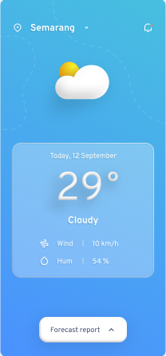
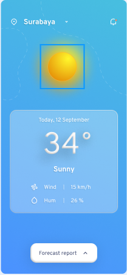

# ☀️🌧️ Aplicativo de Previsão do Tempo 🌈❄️

## 🌐 Descrição

Bem-vindo ao nosso Aplicativo de Previsão do Tempo, uma solução completa para todas as suas necessidades meteorológicas! Este aplicativo fornece informações meteorológicas atualizadas e precisas, permitindo que você esteja sempre um passo à frente do clima.

## ⚡ Características

1. **Previsão do tempo em tempo real**: Informações meteorológicas em tempo real na ponta dos seus dedos, incluindo temperatura, umidade, velocidade do vento e direção.

2. **Previsão para vários dias**: Planeje sua semana com facilidade com a previsão do tempo para os próximos 7 dias.

3. **Busca por localização**: Quer saber como está o tempo em Paris ou em Nova York? Nossa função de busca permite que você veja a previsão do tempo para diferentes localizações ao redor do mundo.

4. **Alertas meteorológicos**: Fique seguro com nossos alertas sobre condições meteorológicas severas, como tempestades, nevascas e ondas de calor.

## 🚀 Como usar

Depois de instalar o aplicativo, abra-o e permita que ele acesse sua localização para obter a previsão do tempo para sua área atual. Você pode pesquisar outras localizações usando a barra de pesquisa na parte superior do aplicativo.

## 💖 Suporte

Sua opinião é muito importante para nós! Se você tiver algum problema ou sugestão, por favor, entre em contato conosco em support@weatherapp.com.

## 🌟 Contribua

Adoraríamos ter você conosco na jornada para tornar este aplicativo melhor a cada dia. Se você é um desenvolvedor e deseja contribuir, sinta-se à vontade para fazer um fork deste repositório e enviar um pull request.

## 📃 Licença

Este projeto está licenciado sob a licença MIT - veja o arquivo LICENSE.md para mais detalhes.
